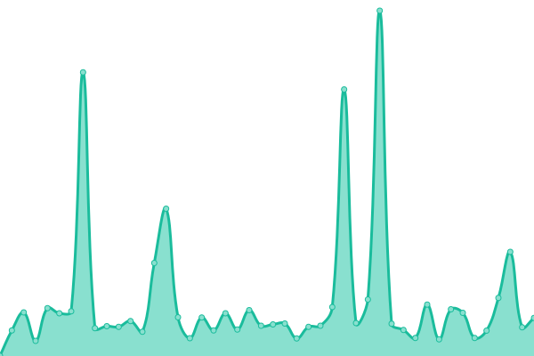

# [📈 Live Status](https://status.prevhelp.de): <!--live status--> **🟩 All systems operational**

This repository contains the open-source uptime monitor and status page for [PrevPlan](https://ausbilder.org), powered by [Upptime](https://github.com/upptime/upptime).

With [Upptime](https://upptime.js.org), you can get your own unlimited and free uptime monitor and status page, powered entirely by a GitHub repository. We use [Issues](https://github.com/prevplan/prevhelp-status/issues) as incident reports, [Actions](https://github.com/prevplan/prevhelp-status/actions) as uptime monitors, and [Pages](https://status.prevhelp.de) for the status page.

<!--start: status pages-->
<!-- This summary is generated by Upptime (https://github.com/upptime/upptime) -->
<!-- Do not edit this manually, your changes will be overwritten -->
<!-- prettier-ignore -->
| URL | Status | History | Response Time | Uptime |
| --- | ------ | ------- | ------------- | ------ |
|  [prevhelp.de](https://prevhelp.de) | 🟩 Up | [prevhelp-de.yml](https://github.com/prevplan/prevhelp-status/commits/HEAD/history/prevhelp-de.yml) | 

 802ms
     
 | 

<a href="https://status.prevhelp.de/history/prevhelp-de">100.00%</a>
    

|  [prevhelp.com](https://prevhelp.com) | 🟩 Up | [prevhelp-com.yml](https://github.com/prevplan/prevhelp-status/commits/HEAD/history/prevhelp-com.yml) | 

 700ms
     
 | 

<a href="https://status.prevhelp.de/history/prevhelp-com">100.00%</a>
    

|  [PrevHelp Termine](https://termine.prevhelp.de) | 🟩 Up | [prev-help-termine.yml](https://github.com/prevplan/prevhelp-status/commits/HEAD/history/prev-help-termine.yml) | 

 1341ms
     
 | 

<a href="https://status.prevhelp.de/history/prev-help-termine">100.00%</a>
    

|  [PrevHelp Support](https://support.prevhelp.de) | 🟩 Up | [prev-help-support.yml](https://github.com/prevplan/prevhelp-status/commits/HEAD/history/prev-help-support.yml) | 

 618ms
     
 | 

<a href="https://status.prevhelp.de/history/prev-help-support">100.00%</a>
    

|  PrevHelp Ticket System | 🟩 Up | [prev-help-ticket-system.yml](https://github.com/prevplan/prevhelp-status/commits/HEAD/history/prev-help-ticket-system.yml) | 

 186ms
     
 | 

<a href="https://status.prevhelp.de/history/prev-help-ticket-system">83.06%</a>
    

|  [SMTP Server](mail.prevmail.de) | 🟩 Up | [smtp-server.yml](https://github.com/prevplan/prevhelp-status/commits/HEAD/history/smtp-server.yml) | 

 151ms
     
 | 

<a href="https://status.prevhelp.de/history/smtp-server">99.36%</a>
    

|  TOR Node | 🟩 Up | [tor-node.yml](https://github.com/prevplan/prevhelp-status/commits/HEAD/history/tor-node.yml) | 

 176ms
     
 | 

<a href="https://status.prevhelp.de/history/tor-node">100.00%</a>
    

<!--end: status pages-->

[**Visit our status website →**](https://status.prevhelp.de)

## 📄 License

- Powered by: [Upptime](https://github.com/upptime/upptime)
- Code: [MIT](./LICENSE) © [PrevPlan](https://ausbilder.org)
- Data in the `./history` directory: [Open Database License](https://opendatacommons.org/licenses/odbl/1-0/)
